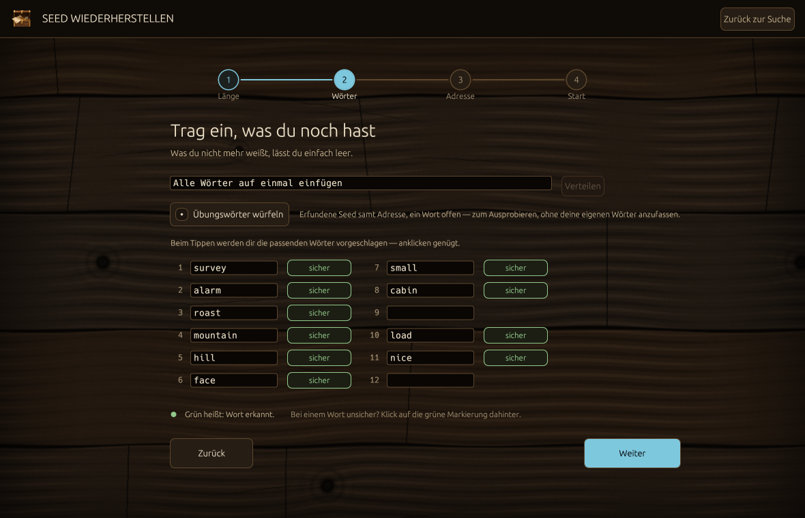

# Schatzsuche

**Ein Programm, das zufällige Bitcoin-Wallets errät — und dabei beweist, dass das
nicht funktioniert.**

Schatzsuche würfelt BIP-39-Seeds aus echter Betriebssystem-Entropie, leitet für
jeden die BIP-44/49/84-Adressen ab und prüft sie gegen eine lokale Liste von
Adressen mit Guthaben. Dann rechnet es aus, wie lange ein Treffer dauern würde,
und zeigt das Ergebnis in **Vielfachen des Alters des Universums** an.

Auf einem Apple M1 sind das rund 10¹⁹ Universumsalter — mit den Voreinstellungen
und einer Datenbank aus 5 Mio. Adressen. Diese Zahl ist der Punkt des Programms.

Sie hängt an der Größe der Datenbank: Mit einem echten Dump in der Größenordnung
von 50 Mio. Adressen wird sie zehnmal kleiner. Also 10¹⁸ statt 10¹⁹ Universen —
ein Unterschied, den nur die Schreibweise sichtbar macht, und keiner, der etwas
an der Aussage ändert.


> Es findet nichts. Nicht selten — nie. Wer etwas anderes verspricht, verkauft
> dir etwas.

## Warum das kein Angriffswerkzeug ist

Die Suche ist **gleichverteilt über den gesamten Schlüsselraum**. Die Entropie
kommt direkt aus `getrandom`, nichts wird aus einem Pseudozufallsgenerator
expandiert, und kein Seed wird in Richtung schwacher oder bekannt kaputter
Generatoren gelenkt.

Genau das ist der Unterschied. Werkzeuge, die tatsächlich fremde Wallets leeren,
suchen nicht zufällig — sie zielen auf Brainwallets, defekte Zufallsgeneratoren
oder Wortlisten. Schatzsuche tut nichts davon und wird es nicht tun.

Wer den Beweis will, findet ihn in `src/engine.rs`: Entropie rein, nichts
dazwischen.

### Und wenn doch etwas gefunden wird?

Wird es nicht — dafür steht die Zahl oben. Aber falls jemand eine echte
Adressdatenbank benutzt und das Unmögliche eintritt: Das Guthaben hinter einer
gefundenen Adresse gehört jemand anderem. Es auszugeben ist Diebstahl, egal wie
der Schlüssel zustande kam. Das Programm schreibt einen Treffer ausschließlich
auf die eigene Festplatte und schickt ihn nirgendwohin — was danach damit
geschieht, ist keine technische Frage mehr.

## Installation

Fertige Programme für macOS, Linux und Windows liegen unter
[Releases](../../releases). Im Mac-Archiv liegt zusätzlich `Schatzsuche.app`
zum Doppelklicken.

**Beim ersten Start meldet sich das Betriebssystem zu Wort.** Die Programme sind
nicht signiert — das bräuchte ein kostenpflichtiges Entwicklerkonto bei Apple
beziehungsweise ein Zertifikat für Windows:

* **macOS** verweigert den ersten Start. Danach unter *Systemeinstellungen →
  Datenschutz & Sicherheit* auf **„Dennoch öffnen"** klicken. Oder vorher im
  Terminal die Quarantäne-Markierung entfernen:

  ```bash
  xattr -dr com.apple.quarantine Schatzsuche.app
  ```

* **Windows** zeigt einen SmartScreen-Hinweis: *Weitere Informationen →
  Trotzdem ausführen*.

* **Virenscanner schlagen womöglich an.** Ein Programm, das im Sekundentakt
  Wallet-Schlüssel erzeugt, sieht für eine Heuristik aus wie ein Wallet-Dieb.
  Wem das zu heikel ist: Der Quelltext liegt vollständig hier, und selbst bauen
  dauert eine Minute.

Selbst bauen:

```bash
cargo build --release
```

Getestet wurde gegen **Linux x86-64** und **Windows x86-64** per
Cross-Kompilierung mit Zig; beide Binaries entstehen fehlerfrei. Jeder Commit
wird zusätzlich auf echten Linux-, macOS- und Windows-Rechnern gebaut und
getestet.

Auf dem eigenen Rechner lohnt sich der Prozessor-spezifische Build — rund 13 %
mehr Tempo, dafür läuft die Datei nur auf dieser CPU-Generation:

```bash
RUSTFLAGS="-C target-cpu=native" cargo build --release
```

Das Mac-App-Bundle aus einem eigenen Build — nötig, damit der Doppelklick ein
Fenster öffnet statt eines Terminals:

```bash
bash scripts/make-macos-app.sh target/release/schatzsuche dist
```

Unter Linux werden dafür die GUI-Bibliotheken gebraucht:

```bash
sudo apt install libgtk-3-dev libxkbcommon-dev libxcb-render0-dev libxcb-shape0-dev libxcb-xfixes0-dev libssl-dev libdbus-1-dev
```

## Erste Schritte

```bash
schatzsuche init-config
schatzsuche synth-db --count 5000000
schatzsuche --test-persistence
schatzsuche --gui
```

`synth-db` baut eine synthetische Datenbank, damit die ganze Kette ohne echten
Dump läuft. Mit einem echten Dump funktionierter Adressen stattdessen:

```bash
schatzsuche build-db --input dump.tsv
```

Ohne Argumente startet das Programm im Terminal. Unter macOS öffnet der
Doppelklick auf das App-Bundle ein Fenster; auf allen Systemen erzwingt `--gui`
das Fenster.

Im Fenster **rechnet zunächst nichts**. Es öffnet auf einer Gabelung — Suche oder
Seed-Rettung —, und auch dahinter fängt die Suche erst an, wenn du den Knopf
„Suche starten" drückst oder die Leertaste. Was Rechenzeit und Strom kostet,
läuft auf Ansage und nicht von selbst.

## Bedienung

| Taste | Wirkung |
| --- | --- |
| Leertaste, Knopf START/STOPP | Suche anhalten und fortsetzen |
| ↑ ↓, Klick auf einen Treffer | Treffer auswählen |
| ⌘ , (Strg + ,) | Einstellungen auf- und zuklappen |
| Esc | Zurück: erst das Wort-Feld, dann Einstellungen oder Seed-Rettung |
| beliebige Taste im Vorspann | Vorspann überspringen |
| ⌘ Q (Alt + F4) | Beenden |

Solange in einem Feld getippt wird, gehören alle Tasten dem Feld — eine
Leertaste im Seed-Wort landet im Wort und hält nicht die Suche an. Ein
einzelnes `q` beendet nichts: dafür gibt es den Weg, den das Betriebssystem
ohnehin kennt.

Rechts steht das **Fundfach**: dort erscheint eine gefundene Wallet mit ihrem
Guthaben, und ein Klick auf die Zeile klappt die Wörter nummeriert darunter auf.
Solange nichts gefunden ist — also immer — steht dort, was dort stünde, und der
Probealarm.

## Wortlänge

BIP-39 kennt fünf Längen, und alle fünf lassen sich wählen — in den
Einstellungen, **im laufenden Betrieb**, ohne Neustart:

| Wörter | Entropie | Suchraum |
| --- | --- | --- |
| 12 | 128 Bit | 2¹²⁸ |
| 15 | 160 Bit | 2¹⁶⁰ |
| 18 | 192 Bit | 2¹⁹² |
| 21 | 224 Bit | 2²²⁴ |
| 24 | 256 Bit | 2²⁵⁶ |

**Voreingestellt sind 12 Wörter** — die Länge, die fast jede Wallet ausgibt.
Dauerhaft ändern über `word_count` in der `config.toml` oder `--words 24` beim
Start.

Jede Stufe kürzer sind drei Wörter weniger und damit ein 4-Milliarden-fach
kleinerer Raum. **An der Aussichtslosigkeit ändert das nichts** — und an der
Hochrechnung oben ebenfalls nicht: Ein Treffer verlangt eine Kollision im
160-Bit-Adressraum, und der ist bei zwölf Wörtern derselbe wie bei
vierundzwanzig. Kürzere Seeds durchsuchen ihren eigenen Raum schneller, ohne
einer fremden Wallet näher zu kommen.

## Leistung und Stromverbrauch

**Das Programm sucht sich seine Einstellung selbst.** Beim Start liest es die
Hardware aus und nimmt die schnelle Hälfte: auf Rechnern mit getrennten
schnellen und sparsamen Kernen genau die schnellen, sonst die Hälfte aller
Kerne. Ein Achtkern-Mac arbeitet also mit vier Kernen, ein Zweikern-Laptop mit
einem, ein Sechzehnkerner mit acht — die andere Hälfte bleibt für alles übrige
frei. Was erkannt wurde, steht in den Einstellungen und beim Terminalstart:

```
Maschine   : 8 Kerne erkannt — 4 schnelle, 4 sparsame → 4 Arbeiter automatisch
```


Warum nicht alles? Weil die zweite Hälfte am wenigsten bringt (siehe Tabelle:
vier Kerne erreichen 72 % von acht) und ein Rechner, dem man alle Kerne
weggenommen hat, sich nicht mehr wie der eigene anfühlt. Wer es anders will,
stellt `threads` in der `config.toml` fest ein oder schiebt den Regler im
Fenster — auch das im laufenden Betrieb.

### Unauffällig — für alle, die es trotzdem laufen lassen wollen

Die Zahlen oben sagen, dass es nichts findet. Wer es trotzdem im Hintergrund
mitlaufen lassen will, soll das tun können, ohne es zu merken. Dafür gibt es
die Voreinstellung **„Unauffällig"**: ein Kern, niedrigste Priorität, und
**ein Prozent Einschaltdauer**.

Die niedrigste Priorität allein reicht dafür nicht — sie schiebt die Arbeit nur
auf die sparsamen Kerne, laufen tut sie weiter. Deshalb misst der Arbeiter, wie
lange ein Kandidat gedauert hat, und legt sich anschließend für das
Neunundneunzigfache davon schlafen. Das hält den Anteil auf jeder Maschine
gleich, egal wie schnell sie ist.

Gemessen auf einem M1: **unter 1 % eines Kerns**, im Mittel etwa ein halbes
Prozent — auf einem Achtkerner also rund ein Zehntel Prozent der Maschine. Kein
Lüfter, kein spürbarer Akkuverbrauch, nichts, was in der Energieübersicht
auffällt.

Der Preis ist ein Hundertstel der Geschwindigkeit. Gegen 10¹⁹ Universumsalter
ist das kein Unterschied, der eine Rolle spielt.

Dauerhaft über `throttle_percent` in der `config.toml` oder `--throttle 1`.

Kernanzahl, Priorität und Adressen pro Wallet lassen sich **im laufenden
Betrieb** ändern. Statt den Thread-Pool neu zu bauen, parkt sich ein Worker
oberhalb der eingestellten Kernzahl selbst — über dieselbe Bremse, die auch die
Pause benutzt.

Gemessen auf einem **unbelasteten** M1 (4 Leistungs- + 4 Effizienzkerne),
Seeds/s:

| Kerne | Sparsam | Normal | Maximal |
| --- | --- | --- | --- |
| 1 | 191 | 605 | 605 |
| 2 | 320 | 1019 | 1210 |
| 4 | 510 | 1211 | 2425 |
| 6 | 573 | 1337 | 2961 |
| 8 | 509 | 1401 | **3343** |

Drei Dinge daran sind nicht offensichtlich:

* **„Normal" deckelt bei etwa 42 %**, egal wie viele Kerne. macOS hält diese
  Stufe von den Leistungskernen fern.
* **„Sparsam" wird bei acht Kernen langsamer als bei sechs** — die Arbeit ist
  auf vier Effizienzkerne beschränkt, die sich dann gegenseitig behindern.
* **Nur „Maximal" skaliert.** Vier Kerne liefern 72 % der Spitze — deshalb
  landet die automatische Wahl auf dieser Maschine bei vier: fast das ganze
  Tempo für die halbe Maschine. Genau diese Messung ist die Regel, die oben auf
  fremde Hardware übertragen wird.

Die Oberfläche interpoliert ihre Schätzung aus dieser Tabelle und warnt, wenn die
gewählte Kombination sich selbst im Weg steht.

Eine frühere Fassung dieser Tabelle entstand, während das Programm selbst im
Hintergrund lief, und war durchgehend falsch — sie unterschätzte die Spitze um
40 %. Ein Benchmark auf einer beschäftigten Maschine misst die Maschine, nicht
den Code.

Speicherbedarf: rund 25 MB für den Suchfilter, plus die Datenbankdatei, die
speicherabgebildet und damit auslagerbar ist. `bloom_fpr` in `config.toml`
tauscht Filtergenauigkeit direkt gegen Arbeitsspeicher.

Die Priorität wirkt unter macOS und Linux. Windows kennt die Einstellung
derzeit nicht; die Oberfläche sagt das, statt es zu verschweigen.

**Windows ist langsamer.** Die handgeschriebene SHA-512-Kompression aus
`sha2-asm` — auf Apple-Silicon rund 40 % des Gesamtdurchsatzes — unterstützt
Windows nicht; das Paket bricht den Build ab, statt zurückzufallen. Dort läuft
PBKDF2 mit der portablen Implementierung. Gemessener Unterschied auf einem M1:
1400 gegen 1020 Seeds/s bei sonst gleichen Bedingungen.

## Die eigene Seed wiederherstellen

Der ehrliche Gegenpol zum Collider. Die Hauptsuche findet nichts, weil sie im
gesamten Schlüsselraum sucht. Wenn du aber deine **eigene** Wallet
wiederherstellst — du hast die meisten Wörter, dir fehlt nur ein Teil —, ist
der Raum klein genug, dass ein Treffer nicht nur möglich, sondern wahrscheinlich
ist.

**Am einfachsten im Fenster:** Knopf **„Seed retten"**. Es führt in vier
Schritten durch die Sache, eine Frage pro Bild, und man kann jederzeit zurück:

| | Schritt | Frage |
| --- | --- | --- |
| 1 | **Länge** | Wie viele Wörter hat deine Seed? |
| 2 | **Wörter** | Trag ein, was du noch hast |
| 3 | **Adresse** | Kennst du eine Adresse deiner Wallet? (freiwillig) |
| 4 | **Start** | Wie stark soll der Rechner arbeiten? |

Hinter jedem Wort sagt ein Knopf, wie sicher du dir bist:

| Markierung | Bedeutung | Suchaufwand |
| --- | --- | --- |
| **sicher** (grün) | Wort stimmt | keiner |
| leer / **unsicher** (gelb) | Wort fehlt oder könnte falsch sein | 2048 je Wort |
| **verrutscht** (violett) | Reihenfolge unklar | k! je zusammenhängender Gruppe |

Die Markierungen lassen sich **kombinieren** — zwei fehlende Wörter und ein
vertauschtes Paar sind eine einzige Suche. Im letzten Schritt steht, wie groß
der Raum ist und wie lange es schätzungsweise dauert.

**Vorher gefahrlos ausprobieren:** auf Schritt 2 steht ein Würfel,
**„Übungswörter würfeln"**. Er setzt eine erfundene Seed samt passender Adresse
ins Formular und lässt ein Wort offen — damit läuft der ganze Ablauf einmal
durch und endet mit genau dieser Seed als Treffer. Ein Streifen über dem
Formular sagt die ganze Zeit, dass es Übungsdaten sind. Gespeichert und gemeldet
wird dabei nichts: mit einer Zieladresse prüft die *Suche* keine Guthaben, also
kommt auch kein Eintrag in `hits.txt`. Auch der Kontostand-Knopf bleibt bei
einem Übungslauf weg — eine erfundene Adresse an einen fremden Dienst zu schicken
hat keinen Zweck. Man lernt die Bedienung damit **vor** dem Ernstfall statt in
ihm.

**Keine Größe wird abgelehnt.** Vier fehlende Wörter sind siebzehn Billionen
Möglichkeiten, die niemand zu Ende rechnet — das Programm sagt genau das und
startet trotzdem, wenn du es willst. Wie eine aussichtslose Suche aussieht, ist
schließlich das Thema dieses Programms. Nur ein *zusammenhängender* Block
verrutschter Wörter ist auf acht begrenzt, und das aus Speichergründen: ihre
Reihenfolgen werden als Liste erzeugt, und k! wächst schneller als jeder
Arbeitsspeicher.

### Die Adresse ist freiwillig

| | Was passiert |
| --- | --- |
| **mit Adresse** | Am Ende bleibt genau die eine Seed übrig, die zu dieser Wallet gehört. |
| **ohne Adresse, wenige Möglichkeiten** | Du bekommst sie aufgelistet, jede mit ihrer ersten Adresse zum Vergleichen. |
| **ohne Adresse, viele Möglichkeiten** | Jede mögliche Seed wird gegen die Adress-Datenbank geprüft. Findet sich eine Wallet **mit Guthaben**, bekommst du Wörter und Betrag — gespeichert wie ein regulärer Fund, mit Sicherungskopie und Benachrichtigung. |

Leere Wallets werden dabei weder gespeichert noch gemeldet: Adress-Auszüge sind
voll von Adressen, die längst leergeräumt sind, und ein Alarm für einen
Kontostand von null ist ein Fehlalarm.

> Das setzt eine **echte** Adress-Datenbank voraus. Mit der Übungs-Liste aus
> `synth-db` findet diese Suche garantiert nichts — darin stehen nur
> Zufallsadressen, die niemandem gehören. Siehe `build-db`.

**Beim Eintippen hilft das Fenster mit:**

* Wer seine Wörter schon irgendwo stehen hat, fügt sie **alle auf einmal** ein
  und drückt „Verteilen"; `?` steht für ein fehlendes Wort. Passt die Anzahl zu
  einer Seed-Länge, stellt sich das Formular selbst darauf um.
* Während getippt wird, stehen unter dem Feld die **passenden BIP-39-Wörter**
  zum Anklicken — 2048 Wörter muss niemand auswendig können.
* Hinter jedem Feld sagt ein Punkt, wie das Wort gelesen wurde: grün heißt
  „steht genau so auf der Liste", rot heißt „steht nicht drauf".
* Steht dort ein **gelber Punkt mit einem anderen Wort**, dann hat das Programm
  etwas anderes verstanden, als du geschrieben hast. Vier Buchstaben genügen
  nämlich, um ein BIP-39-Wort eindeutig zu bestimmen — aus `aban` wird
  `abandon`, und aus dem Vertipper `abandonn` eben auch. Das ist gewollt, aber
  du sollst es sehen und nicht raten müssen.



Fürs Terminal gibt es dasselbe kompakter — `?` für ein fehlendes Wort, ein
angehängtes `*` für ein unsicheres:

```bash
schatzsuche recover \
  --words "zoo abandon ? year wave* … about" \
  --address bc1q…
```

Beide Wege rechnen zuerst Suchraum und Dauer aus, zeigen eine **Warnung** und
verlangen eine ausdrückliche Bestätigung, bevor sie loslegen.

Ein bewusst *nicht* angebotener Fall ist die freie Umsortierung aller Wörter:
24 Wörter lassen sich 6·10²³-fach anordnen — das ist wieder Collider-Gebiet,
und die eingebaute Obergrenze lehnt es ab.

**Sicherheit:** Für das spätere Benutzen der Seed muss der Rechner am Netz sein
— ein Risiko, das die Warnung ausspricht. Die Wörter selbst verlassen den
Rechner nie; sie werden nur lokal durchprobiert, nachprüfbar in
`src/recover.rs`.

**Kontostand.** Nach einem Fund steht dort, was die lokale Adressliste über die
Wallet weiß — kostenlos und ohne Netz. Weil diese Liste aber nur die Adressen
kennt, die du geladen hast, ist „steht nicht drin" dort die normale Antwort und
heißt **nicht** „leer". Für die echte Zahl gibt es einen Knopf
**„Kontostand online prüfen"**. Der schickt die ersten Adressen der Wallet — und
nur die, niemals die Wörter — an den Dienst aus `[balance] api`, voreingestellt
`mempool.space`. Bei einem Übungslauf gibt es ihn nicht. Wer einen eigenen Node
hat, trägt ihn dort ein; dann sieht niemand sonst, welche Adressen nachgeschaut
wurden.

Von allein läuft die Abfrage nur, wenn du das **vorher** erlaubt hast: auf dem
letzten Schritt vor dem Start steht dafür ein Häkchen, samt der Angabe, an
welchen Dienst die Adressen dann gehen. Ohne Haken bleibt es beim Knopf. Die
Frage steht dort und nicht auf dem Ergebnisbildschirm, weil sie vorher noch
eine Entscheidung ist — neben einer gerade zurückgeholten Wallet wäre sie nur
noch eine Mitteilung.

Gesucht wird nach dem **Gap-Limit**: je Ableitungsschema so weit, bis zwanzig
leere Adressen hintereinander kommen. Das ist die Zahl aus BIP-44 und das, was
ein Wallet-Programm tut — Geld auf Adresse sieben wird also gefunden. „Alle"
Adressen gibt es nicht, je Kette sind gut zwei Milliarden möglich; darum steht
unter der Zahl, wie viele tatsächlich angesehen wurden.

## Wohin ein Treffer geht

Die Reihenfolge ist ein Haltbarkeitsversprechen, kein Stilmittel:

1. Vollständiger Datensatz nach `hits.txt` — Wörter, Entropie, privater
   Schlüssel, Pfad, Adresse, Betrag, Zeitstempel, Rechnername. Eine **schlichte
   Textdatei** mit beschrifteten Zeilen, kein Datenformat: wer sie öffnet, tut
   das genau einmal im Leben und soll dann seine Wörter lesen können, nicht
   geschweifte Klammern. Ältere Fassungen schrieben `hits.jsonl`; die Datei
   wird weiterhin mitgelesen, auch gemischt mit neuen Einträgen.
2. Rechte auf 0600, dann `F_FULLFSYNC` auf die Datei **und** ein `fsync` auf das
   Verzeichnis. Unter macOS lässt `fsync(2)` die Daten im flüchtigen
   Schreibpuffer der SSD; `F_FULLFSYNC` ist die einzige echte Barriere.
3. Zweite Kopie nach `hits_backup.txt` (am besten auf ein anderes Laufwerk).
4. Im Fenster: ein Band quer über den Bildschirm, ein Ton, und das Symbol im
   Dock hüpft, bis du hinschaust. Die Wörter erscheinen **erst auf Klick** —
   nicht von selbst, damit sie nicht ungefragt auf einem geteilten Bildschirm
   stehen. Im Terminal stattdessen die Glocke.
5. *Erst danach* die Benachrichtigungskette — Systemmeldung mit Ton, und was
   sonst in `config.toml` eingeschaltet ist.
6. Die Suche läuft weiter.

Ob du das nachts mitbekämst, musst du nicht glauben: der Knopf **Probealarm**
im Fundfach löst genau diese Meldung einmal aus. Er speichert nichts und legt
keinen Eintrag an.

## Der Seed verlässt den Rechner nie

`AlertPayload` hat **kein Feld**, das ein Mnemonic aufnehmen könnte. Das ist
durch den Typ erzwungen, nicht durch Disziplin an jeder einzelnen Stelle — ntfy,
Telegram und SMTP laufen über fremde Server, und ein Seed in einer
Push-Nachricht ist ein Seed auf fremder Infrastruktur, dauerhaft.

Benachrichtigungen enthalten: Zeitstempel, Rechnername, Ableitungspfad,
Skripttyp, Adresse, Betrag und den Hinweis, dass der Seed lokal liegt. Der Test
`alert_payload_never_contains_seed` bricht den Build, falls sich das je ändert.

Zusätzlich verweigert das Programm den Start, wenn ntfy aktiviert ist und das
Thema noch auf dem Beispielwert steht oder zu kurz ist. ntfy-Themen sind
öffentlich — jeder, der den Namen errät, liest mit.

## Benachrichtigungen

Fünf Kanäle über das `Notifier`-Trait: ntfy, Telegram, SMTP, generischer
JSON-Webhook und lokale Desktop-Meldung. Aktivierung in `config.toml`.

* Alle Kanäle feuern gleichzeitig, je ein Thread, mit festen Zeitlimits. Ein
  toter Kanal verzögert nur sich selbst.
* Exponentieller Backoff, fünf Versuche pro Kanal.
* Scheitern *alle*, landet die Nachricht in `pending_alerts.jsonl` und wird alle
  60 Sekunden erneut versucht, bis einer durchkommt.
* Dedupliziert über die Treffer-ID, damit Wiederholungen keine Lawine auslösen.

Vor dem Vertrauen einmal mit `--test-alert` durchspielen.

## Wo die Zeit hingeht

`schatzsuche bench` misst jede Stufe einzeln. Auf einem M1 mit 20 Adressen pro
Pfad:

| Stufe | Zeit | Anteil |
| --- | --- | --- |
| PBKDF2-HMAC-SHA512, 2048 Runden | 702 µs | 28 % |
| Elliptische Kurve + BIP-32 | 1811 µs | 72 % |
| Alles andere | ~1 µs | 0 % |

**PBKDF2 ist bei dieser Einstellung nicht der Flaschenhals.** Es dominiert nur
unterhalb von etwa 8 Adressen pro Pfad; darüber kosten die 66
`ecmult_gen`-Aufrufe je Seed mehr. `bench` gibt diesen Umschlagpunkt für die
eigene Konfiguration aus.

Zwei gemessene Optimierungen:

| Schritt | Seeds/s pro Kern | Änderung |
| --- | --- | --- |
| Ausgangspunkt | 270 | — |
| `sha2/asm` (Hardware-SHA-512 der M1) | 351 | +30 % |
| Public Keys nur bei Bedarf (BIP-32) | 398 | +13 % |

Gehärtete Ableitung braucht nie den öffentlichen Schlüssel des Elternknotens —
ihn trotzdem zu berechnen war reine Verschwendung, 10 von 73
`ecmult_gen`-Aufrufen pro Seed.

## Nachschlagen

Zwei Stufen. Ein cache-line-blockierter Bloom-Filter (16 Spuren à 32 Bit = ein
ausgerichteter 64-Byte-Block, ein Bit je Spur, also **ein** Cache-Fehlzugriff
statt sechzehn), danach bei einem Treffer binäre Suche in einer
speicherabgebildeten sortierten Datei.

Die Filtergröße wird numerisch gegen ein Modell gelöst, das über die
poissonverteilte Blockbelegung mittelt. Nach der Lehrbuchformel — die bei der
mittleren Belegung rechnet — liegt die echte Rate um etwa Faktor 100 daneben,
weil die Rate konvex in der Belegung ist und die vollen Blöcke dominieren.

Gemessen gegen 5 Mio. Einträge: 2 Fehlalarme auf 2,39 Mio. Abfragen (8,4e-7) bei
1e-6 Ziel, alle von der Plattenstufe verworfen.

## Tests

```bash
cargo test --release
```

228 Tests. Die tragenden:

* BIP-39/32/44/49/84-Ableitung gegen die Referenzbibliotheken `bitcoin` und
  `bip39` über zufällige Seeds, plus die veröffentlichten Testvektoren.
* `alert_payload_never_contains_seed` — die Garantie, dass nichts durchsickert.
* `bloom_survives_structured_keys` — Regressionstest für einen Fehler in der
  Sondenverteilung, der die Fehlalarmrate auf 16 % hochtrieb.
* `placeholder_ntfy_topic_is_rejected` — der Start muss verweigert werden.
* `synthetic_hits_are_labelled_not_celebrated` — ein Selbsttest-Eintrag darf nie
  wie ein echter Fund aussehen.
* `workers_above_the_active_count_park` — die Kernsteuerung im laufenden Betrieb.
* Die Terminaloberfläche wird abseits des Bildschirms gerendert und auf Inhalt
  geprüft. Das Fenster nicht — dort prüfen die Tests die Rechenmodelle und
  Texte, nicht das fertige Bild.
* `recommendation_holds_for_machines_we_do_not_have` — die automatische
  Kernwahl, durchgerechnet für Rechnerformen, die hier nicht auf dem Tisch
  stehen.

Jeder Commit wird unter Linux, macOS und Windows gebaut, getestet und geprüft.

## Lizenz

MIT. Siehe [LICENSE](LICENSE).

Die Wortmarke im Fenster ist in **Ubuntu Bold** gesetzt
(`assets/Ubuntu-Bold.ttf`, © Canonical Ltd.), mitgeliefert unter der Ubuntu
Font Licence 1.0 — der Text liegt als
[assets/UBUNTU-FONT-LICENCE.txt](assets/UBUNTU-FONT-LICENCE.txt) daneben, weil
diese Lizenz verlangt, dass sie mit der Schrift reist. Alles andere ist in den
Schriften gesetzt, die egui selbst mitbringt.

---

*[@21clubz](https://x.com/21clubz)*
